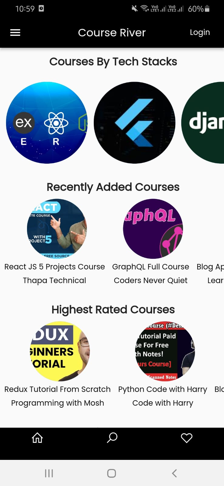
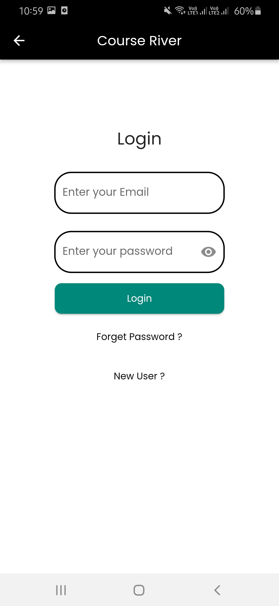
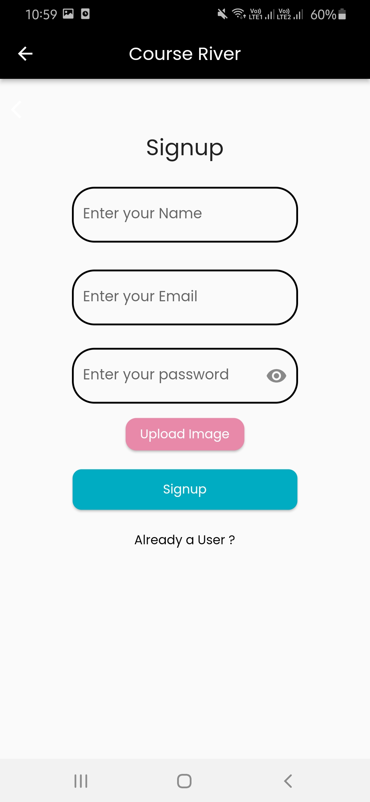
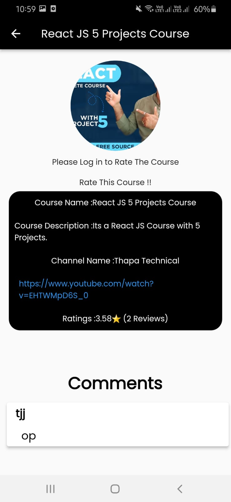
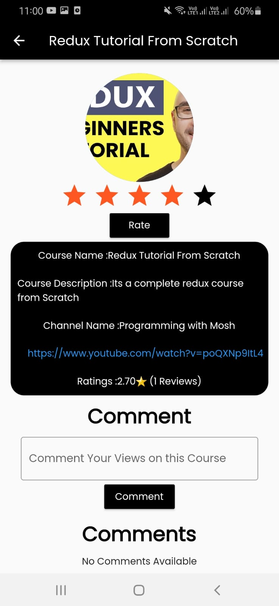
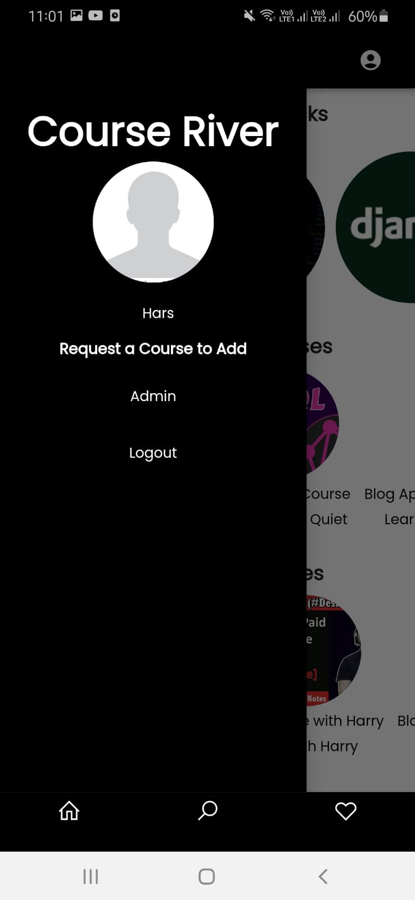
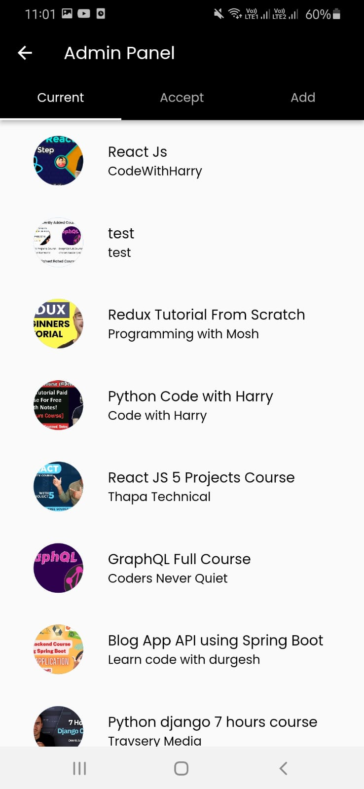
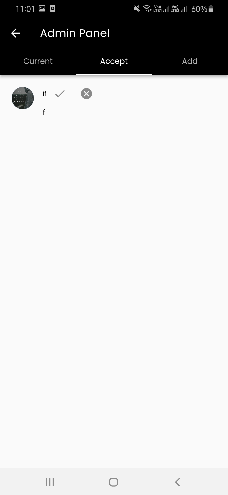
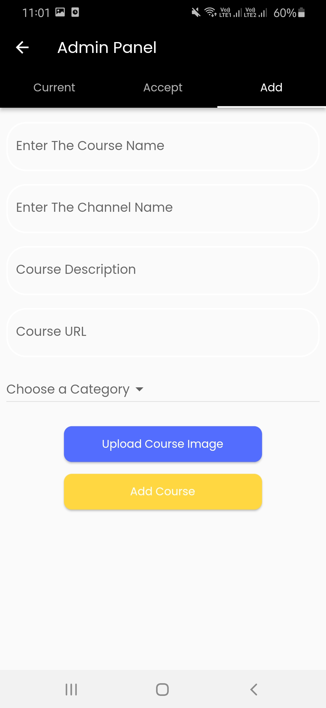
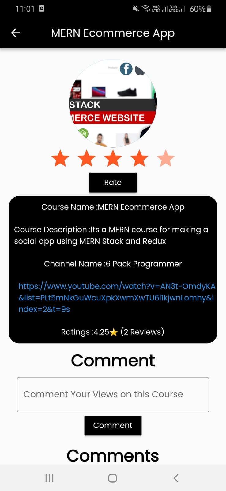

Course river a much need product for the freshers who want to start learning new tech stacks but confused about which course to choose. So this app will help them to choose the best course by the ratings of that particular course. Users who have already seen the course and rate that course and others who want to learn from that course can take reference of that course.

We also have admin panel , who can accept user's request to accept any course , can add more courses.Users are also provided with an form where they can request for any course which they like but currently that course is not in the app. 
 

# Tech stacks used:
* Flutter
* Node.js
* Express.js
* MongoDB
* Provider

# Youtube Video for Complete Demonstration of the project
<a href="https://www.youtube.com/watch?v=ItlXZoG2WlI" target="_blank">Video Link</a>

# Screen shots of the Project 

